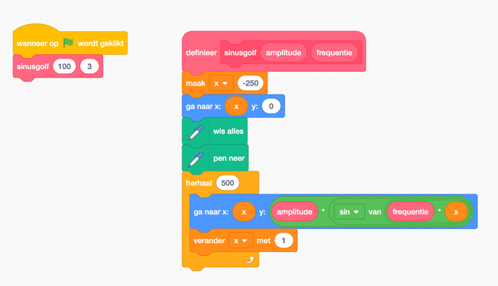

We gaan kunst maken met Scratch.

<!--more-->

## Introductie
Naast een leuke achtergrond en het bewegen van de kat van Scratch kun je nog veel meer doen. Je kunt Scratch ook laten tekenen.

Hier zie je een paar voorbeelden van wat je met Scratch kunt:

|    |    |    |    |
|----|----|----|----|
|||||
   

Deze instructie leert je stap-voor-stap vergelijkbare tekeningen te maken.

## Benodigdheden

Om de instructie te volgen, heb je naast je computer niets nodig.

Ga naar https://scratch.mit.edu/projects/editor/ om aan de stappen te beginnen.

Deze instructies gaan er vanuit dat je de pen uitbreiding gebruikt. Deze moet je eerst activeren:

 * Open het overzicht met uitbreidingen:
  
 * Kies uit het overzicht de pen uitbreiding
  
 * Er zijn nu groene pen blokken beschikbaar die verder in de instructies worden gebruikt
  

## Stappen

### Polygonen
Een polygoon is een ander woord voor een veelhoek. Een veelhoek is een vorm in een plat vlak met een aantal hoeken. Een veelhoek met 3 hoeken is een driehoek. Maar ook een achthoek is een veelhoek. In dit hoofdstuk gaan we veelhoeken tekenen.

#### Driehoek

Een driehoek is een eenvoudige veelhoek. Het bestaat uit 3 hoeken en 3 lijnen. Je kunt deze makkelijk teken met Scratch:

Voor elke hoek doe je twee dingen:

1. neem 100 stappen om een lijn te tekenen
2. draai de pen 120°

En dat herhaal je dan 3 keer.

**Opdracht 1**: Maak het voorbeeld eens na en experimenteer eens met het aantal stappen of de hoeken.

#### Vierhoek

De vierhoek is nog een eenvoudige veelhoek. Het bestaat uit 4 hoeken en 4 lijnen. Ook deze kun je makkelijk teken met Scratch:

Voor elke hoek doe je twee dingen:

1. neem 100 stappen om een lijn te tekenen
2. draai de pen 90°

En dat herhaal je dan 4 keer.

**Opdracht 2**: Neem je code van de driehoek en pas het aan zodat het een vierkant kan maken.  
**Opdracht 3**: Neem je code van de vierhoek en probeer er eens een vijfhoek van te maken. Wat moet er veranderen?

Misschien valt het je op, dat de stappen voor de driehoek, vierhoek en vijfhoek erg vergelijkbaar zijn. Het aantal herhalingen is gelijk aan het aantal hoeken en de hoek van de te maken draai wordt wordt steeds groter.

### Polygoon functie

Bij de vierhoek en vijfhoek zagen we al dat het tekenen ervan vooral bestaat uit herhaling van stappen. Ook is er eigenlijk maar één getalletje dat veranderd; het aantal hoeken.

Om verschillende polygonen te tekenen, is het dus handig om één blokje te hebben waarbij je het aantal hoeken kunt opgeven:

Links staat het nieuwe blok dat polygonen tekent. Rechts staat hoe je het nieuwe blok kunt gebruiken.

**Opdracht 4**: Maak het voorbeeld na. Wat wordt er getekend?  
**Opdracht 5**: Experimenteer eens wat met het aantal hoeken, wat gebeurt er als je een groot aantal hoeken (20?) kiest?  
**Opdracht 6**: Kun je het volgende figuur maken?

### Lissajous
Een lissajous is een vorm gemaakt met een wiskundige formule. Het is een combinatie van twee golven.

De combinatie van twee golven

### Sinusgolf

Voordat we de Lissajous maken, beginnen we met een enkele sinusgolf:

Hieronder de code die hiervoor gebruikt is. Het belangrijkste blokje is het groene, met daarin variabelen amplitude, frequentie en x. Dit blokje zorgt voor de golfvorm.

**Opdracht 7**: Maak het voorbeeld na. Ziet het er hetzelfde uit als in het plaatje?  
**Opdracht 8**: Probeer eens wat te varieren met de waarden van variabele amplitude en een frequentie. Wat gebeurd er?

### Lissajous functie
Hieronder staan een paar voorbeelden van een Lissajous. Met twee getallen (a en b) kan je aanpassen hoe een Lissajous eruit ziet.

  
a = 1, b = 2

  
a = 3, b = 4

  
a = 5, b = 4

De code om er een te maken ziet er als volgt uit: 

- Eerst wordt de pen gereset. Dan wordt de Lissajous functie aangeroepen met drie waardes: maat, a en b.
- Daarna wordt er elke keer de X- en Y-positie berekend. Hiermee wordt de vorm getekend.

Het groene blokje dat zorgt voor de golfvorm, wordt nu twee keer wordt gebruikt in het blauwe 'ga naar' blok.

**Opdracht 9**: Maak het voorbeeld na. Kun je de waarden a en b van de drie voorbeelden gebruiken? Zijn de getekende plaatjes dan hetzelfde als de drie voorbeelden?  
**Opdracht 10**: Probeer eens rare getallen uit voor maar, a en b en kijk wat er gebeurd.  
**Opdracht 11**: Maak de lissajous kleurrijk, zoals als opdracht 6.

## Conclusie
Je hebt nu een indruk gekregen van hoe je met Scratch kunt tekenen. Eerst door veelhoeken of polygonen te tekenen en te herhalen en vervolgens door een Lissajous te maken.

## Vervolg
Heb je de smaak te pakken gekregen van het maken van kunst met Scratch? Kijk dan ook naar deze links:

- Scratch art voorbeelden: https://scratch.mit.edu/search/projects?q=art
- Scratch kunst voorbeelden: https://scratch.mit.edu/search/projects?q=kunst


